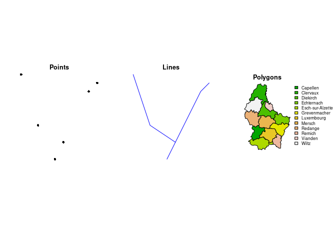

<!-- README.md is generated from README.Rmd. Please edit that file -->

# Introduction to rasters with `terra`

This workshop will provide you with an introduction to manipulating
raster spatial data using the R package `terra`. `terra` and its
predecessor, `raster` are widely used for spatial data manipulation in
R. No prior experience of spatial data is assumed, but this short
workshop will not have time to delve into some important aspects of
spatial data such as projections.

`terra`’s predecessor `raster` had many of the same functions as
`terra`, and I will mention how functions have changed or been renamed
which might be helpful for people migrating from using `raster`. In the
words of the creator of both packages: `terra` is simpler, faster and
can do more, so definitely switch to `terra` if you are still using
`raster`!

The official `terra` tutorial page is
<https://rspatial.org/spatial/index.html>  
And an excellent reference to all the functions in `terra` is
<https://rspatial.github.io/terra/reference/terra-package.html>

<!-- badges: start -->
<!-- badges: end -->

### Prerequisites

You will need the `terra` package installed, which can be done by
running . If you have problems, there are more details about installing
[here](https://rspatial.github.io/terra/index.html). We can then load it

``` r
library(terra)
#> terra 1.7.71
```

## Spatial data

There are basically two types of spatial data: vector and raster

### Vector data

Can be points, lines or polygons. Useful for representing things like
survey locations, rivers, and boundaries.

<!-- -->

### Raster data

Is a grid of rectangles. Each rectangle must have a value. Often used
for data such as elevation, temperature and habitat maps.

<!-- -->
